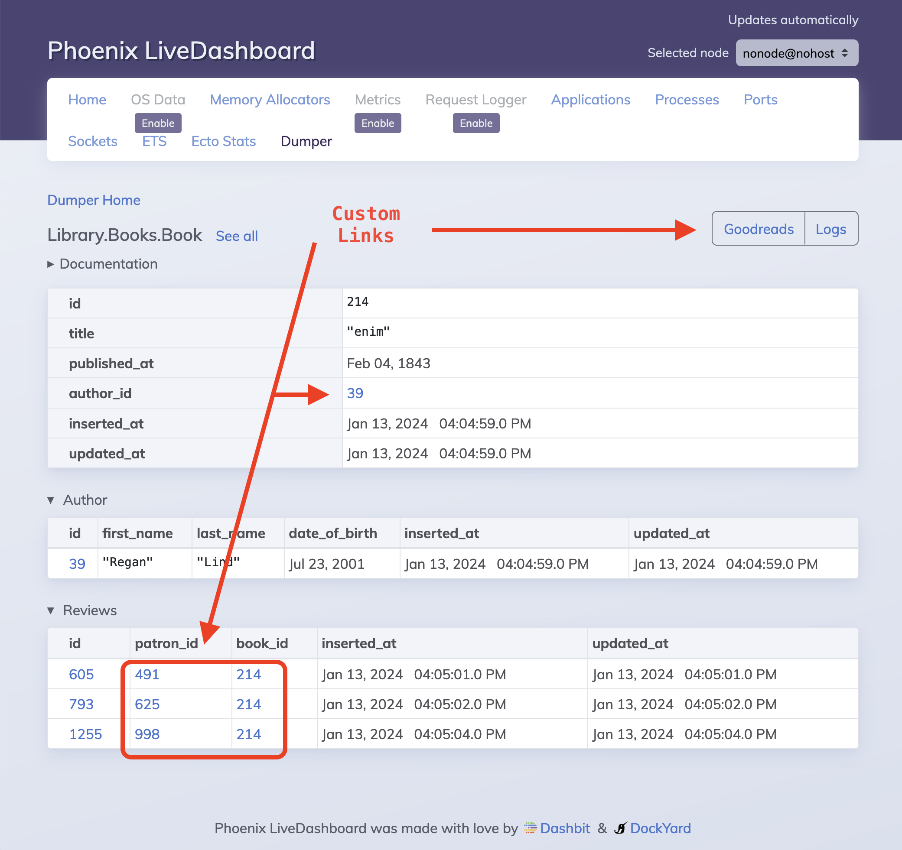

[](https://hex.pm/packages/dumper)
[](https://hexdocs.pm/dumper)
[](https://github.com/adobe/elixir-dumper/actions)

# Dumper

_Takes your data and dumps it to the screen!_

Dumper uses reflection to find all your app's ecto schemas and provide routes to browse their data.  It's packaged as a Live Dashboard plugin for easy navigation.


## Requirements
Dumper only works with Phoenix 1.7+ applications that use Ecto.

## About
Dumper aims to make it as easy as possible for everyone on a project to access and understand its data.

- All ids can be linked, so it's an incredibly fast way to explore a data model against real data.
- Because it's implemented with reflection, it automatically covers every schema module in your project.
- Styling is kept consistent with the LiveDashboard theme so that data is front and center.
- Associations are also shown for a given record, all on the same page.
- Non-intrusive. No changes necessary to existing modules/files.
- Read-only.  No accidentally deleting or editing data while browsing.
- Shareable URLs. Having a shareable link to every record in your database is very useful for debugging. It gives everyone including non-technical teammates the ability to get a better understanding of your data model.

## Installation and Usage
Add `dumper` to your list of dependencies in `mix.exs`:

```elixir
def deps do
  [
    {:dumper, "~> 0.2.0"}
  ]
end
```

Add the following to your `config.exs` to point `dumper` to your Ecto Repo:
```elixir
config :dumper, repo: MyApp.Repo, otp_app: :my_app
```

Install and configure [Phoenix Live Dashboard](https://hexdocs.pm/phoenix_live_dashboard) if you haven't already.  Then modify `router.ex` to include the `dumper` as a plugin:

``` elixir
live_dashboard "/dashboard", additional_pages: [dumper: Dumper.LiveDashboardPage]
```

You can now run your web app, navigate to dumper tab within the live dashboard, and view all your data.

## Customization

### Config Module
It is *highly recommended* to customize the `dumper`.  To do so, you can optionally define a module that implements the `Dumper.Config` behavior.  Add it to the `config.exs`:

``` elixir
config :dumper,
  otp_app: :my_app,
  repo: MyApp.Repo,
  config_module: MyApp.DumperConfig # <---- add this
```

Here's an example config module:

``` elixir
defmodule MyApp.DumperConfig do
  use Dumper.Config

  @impl Dumper.Config
  def ids_to_schema() do
    %{
      book_id: Library.Book,
      author_id: Library.Author
    }
  end

  @impl Dumper.Config
  def allowed_fields() do
    %{Library.BookReview => [:id, :rating]}
  end

  @impl Dumper.Config
  def excluded_fields() do
    %{
      Library.Employee => [:salary, :email_address],
      Library.Book => [:price]
    }
  end

  @impl Dumper.Config
  def display(%{field: :last_name} = assigns) do
    ~H|<span style="color: red"><%= @value %></span>|
  end

  @impl Dumper.Config
  def custom_record_links(%Library.Book{} = book) do
    [
      {"https://goodreads.com/search?q=#{book.title}", "Goodreads"},
      {~p"/logging/#{book.id}", "Logs"}
    ]
  end
end

```

Take a look a `c:Dumper.Config.ids_to_schema/0`, `c:Dumper.Config.allowed_fields/0`, `c:Dumper.Config.excluded_fields/0`, `c:Dumper.Config.display/1`, and `c:Dumper.Config.custom_record_links/1` for more information on how each optional callback lets you customize how your data is rendered.




## Other notes

### Rendering Embeds
The index page and association tables on the show page by default omit columns that are embeds.  This is purely for display purposes, as those values tend to take up a lot of vertical space.  This is currently not configurable, but may be in the future.

### Redactions
By default, schema fields with `redact: true` are hidden and replaced with the text `redacted`.  If you're running the Dumper in a non-production environment or against dummy data, you may want to disregard the redacted fields.  To do that, you can add a `display/1` function head like the following:

``` elixir
def display(%{redacted: true} = assigns), do: ~H|<%= @value %>|
```

You can refine that down to a specific schema and/or field as well by pattern matching the assigns.

### Security
As with LiveDashboard more broadly, it is highly recommended that you put the route behind some sort of [admin authentication](https://hexdocs.pm/phoenix_live_dashboard/Phoenix.LiveDashboard.html#module-extra-add-dashboard-access-on-all-environments-including-production) if you want to use `dumper` in production.

The `c:Dumper.Config.allowed_fields/0` and `c:Dumper.Config.excluded_fields/0`callbacks are another way to be explicit about what data is shown or hidden altogether.

You could also hide the plugin altogether by modifying the live_dashboard route.  For example, this would require a `:dumper` `enabled: true` config to be set in order to display the `dumper` tab in the live dashboard:

``` elixir
live_dashboard "/dashboard",
  additional_pages: [] ++ (if Application.get_env(:dumper, :enabled, false), do: [dumper: Dumper.LiveDashboardPage], else: [])
```

This would allow you to configure showing or hiding the `dumper` based on environments.
