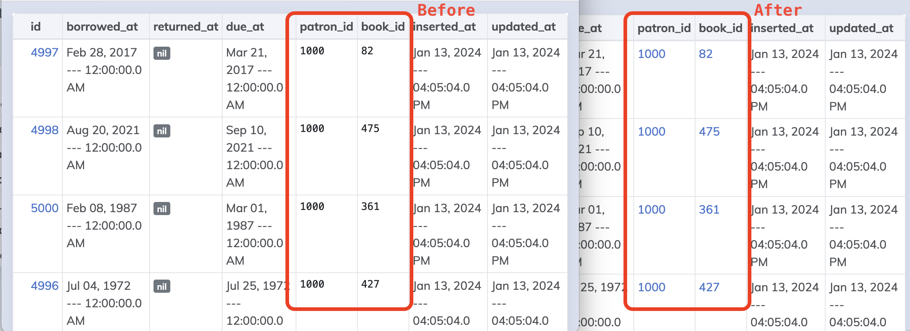

# Dumper

_Takes your data and dumps it to the screen!_

Dumper uses reflection to find all your app's ecto schemas and provide routes to browse their data.  This library provides a mix task to generate the controller and components necessary to do that.


## Requirements

Dumper only works with Phoenix 1.7+ applications that use Ecto.

## About

Dumper aims to make it as easy as possible for everyone on a project to access and understand its data.

- All ids can be linked, so it's an incredibly fast way to explore a data model against real data.
- Because it's implemented with reflection, it automatically covers every schema module in your project.
- Styling is kept to a minimum so that data is front and center.
- All associations are also shown for a given record, all on the same page.
- Non-intrusive. No changes necessary to existing modules/files.
- Read-only.  No accidentally deleting or editing data while browsing.
- Shareable URLs. Having a shareable link to every record in your database is very useful for debugging. It gives everyone including non-technical teammates the ability to get a better understanding of your data model.


## Installation and Usage

Add `dumper` to your list of dependencies in `mix.exs`:

```elixir
def deps do
  [
    {:dumper, "~> 0.2.0"}
  ]
end
```

Add the following to your `config.exs` to point `dumper` to your Ecto Repo:
```elixir
config :dumper, repo: MyApp.Repo
```

Install and configure [Phoenix Live Dashboard](https://hexdocs.pm/phoenix_live_dashboard) if you haven't already.  Then modify `router.ex` to include the `dumper` as a plugin:

``` elixir
live_dashboard "/dashboard", additional_pages: [dumper: Dumper.LiveDashboardPage]
```

You can now run your web app, navigate to dumper tab within the live dashboard, and view all your data.

## Customization

### Config Module
It is *highly recommended* to customize the `dumper`.  To do so, you can optionally define a module that implements the `Dumper.Config` behavior.  Add it to the `config.exs`:

``` diff
 config :dumper,
   repo: MyApp.Repo,
+  config_module: MyApp.DumperConfig
```

Here's an example config module:

``` elixir
defmodule MyApp.DumperConfig do
  use Dumper.Config

  @impl Dumper.Config
  def ids_to_schema() do
    %{
      patron_id: Library.Patrons.Patron,
      book_id: Library.Books.Book,
      author_id: Library.Authors.Author
    }
  end

  @impl Dumper.Config
  def display(%{field: :last_name} = assigns) do
    ~H|<span style="color: red"><%= @value %></span>|
  end
end

```

Let's take a look at each optional function and what it accomplishes.

### ids_to_schema/0

``` elixir
@impl Dumper.Config
def ids_to_schema() do
  %{
    patron_id: Library.Patrons.Patron,
    book_id: Library.Books.Book,
    author_id: Library.Authors.Author
  }
end
```

You can override the `Dumper.Config.ids_to_schema/0` function to provide a map of id names (as atoms) to their corresponding schema modules.  In the above example, when displaying any field/column named `patron_id`, instead of just printing the value, it will render a clickable link to that specific record.  This allows you to quickly and easily navigate through your data by clicking connected links.



### display/1

The `Dumper.Config.display/1` override allows even total control of how any value is displayed.  Here's an example of what `assigns` might contain, which you can then pattern match on:

``` elixir
%{
  module: Library.Authors.Author,
  field: :last_name,
  resource: %Library.Authors.Author{ ... },
  value: "Smith",
  type: :binary, # the Ecto data type
  redacted: false
%}
```

So for example, if you wanted every last name to be red except for the Author table, which should have blue last names, you could do the following:

``` elixir
@impl Dumper.Config
def display(%{field: :last_name, module: Library.Authors.Author} = assigns) do
  ~H|<span style="color: blue"><%= @value %></span>|
end

def display(%{field: :last_name} = assigns) do
  ~H|<span style="color: red"><%= @value %></span>|
end
```

This is admittedly a contrived example, but it can be very useful if you want to change how a particular field, an entire table, or data type is displayed

#### CSS Styling

Note that LiveDashboard ships with [Bootstrap 4.6](https://getbootstrap.com/docs/4.6), so you are free to use Bootstrap classes in your styling to help achieve a consistent look and feel.


## Other notes

### Rendering Embeds
The index page and association tables on the show page by default omit columns that are embeds.  This is purely for display purposes, as those values tend to take up a lot of vertical space.  This is currently not configurable, but may be in the future.

### Redactions
By default, schema fields with `redact: true` are hidden and replaced with the text `redacted`.  If you're running the Dumper in a non-production environment or against dummy data, you may want to disregard the redacted fields.  To do that, you can add a `display/1` function head like the following:

``` elixir
def display(%{redacted: true} = assigns), do: ~H|<%= @value %>|
```

You can refine that down to a specific schema and/or field as well by pattern matching the assigns.
